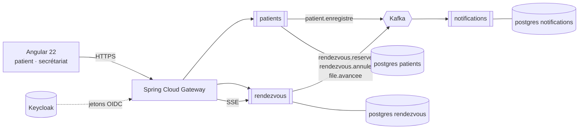

# RDV Santé

**Prise de rendez-vous et file d'attente en temps réel pour cliniques et cabinets médicaux.**

Au Maroc, prendre rendez-vous chez un spécialiste passe encore par un appel au
secrétariat, un carnet papier ou un groupe WhatsApp. Le patient se déplace, puis
attend sans savoir combien de personnes le précèdent. Le secrétariat, lui, jongle
entre le téléphone qui sonne et la salle d'attente qui se remplit.

RDV Santé traite les deux bouts du problème : le patient réserve un créneau en
ligne et **voit sa position dans la file depuis son téléphone** ; le secrétariat
pilote la journée depuis un seul écran.

> **Projet de démonstration.** Les données sont fictives, les cliniques
> inventées. Aucune donnée de santé réelle n'est traitée.

---

## Ce que ce dépôt démontre

| Domaine | Mise en œuvre |
|---|---|
| **Java / Spring Boot** | Java 21, Spring Boot 4.1, Spring Data JPA, Bean Validation |
| **Microservices** | 3 services métier autonomes + une passerelle Spring Cloud Gateway |
| **Messagerie** | Apache Kafka, *outbox* transactionnel, consommation idempotente |
| **Persistance** | PostgreSQL, une base par service, migrations Flyway versionnées |
| **Sécurité** | Keycloak (OAuth2 / OIDC), services en *resource servers*, rôles patient / secrétaire / médecin |
| **Front** | Angular 22, composants standalone, signals, flux temps réel par SSE |
| **Tests** | JUnit 5, Mockito, Testcontainers (PostgreSQL et Kafka réels), objectif > 80 % de couverture |
| **Industrialisation** | Docker Compose, Helm et Kubernetes, GitHub Actions, analyse SonarQube |
| **Observabilité** | Actuator, métriques Prometheus, traçage distribué |

---

## Architecture en une image



Le détail — responsabilités, contrats d'événements, et **pourquoi** chaque choix
a été fait — est dans [docs/architecture.md](docs/architecture.md). Les neuf
décisions structurantes y sont motivées une par une, avec leurs compromis
assumés.

---

## Les trois services

| Service | Responsabilité | Ce qu'il possède |
|---|---|---|
| **patients** | Identité et coordonnées du patient, consentement, préférences de contact | `Patient` |
| **rendezvous** | Cliniques, praticiens, créneaux, réservations, file d'attente du jour | `Clinique`, `Praticien`, `Creneau`, `RendezVous`, `FileAttente` |
| **notifications** | Rappels et confirmations, historique des envois, anti-doublon | `Notification`, `Preference` |

Aucun service n'appelle un autre en HTTP. Ils communiquent **uniquement par
événements Kafka** : une clinique dont le service de notification tombe continue
de prendre des rendez-vous.

---

## Démarrage

### Prérequis

- JDK 21 (`java -version` doit afficher 21)
- Docker Desktop (PostgreSQL, Kafka et Keycloak tournent en conteneurs)
- Node 22 ou 24 pour le front

### Lancer

```bash
# 1. l'infrastructure : PostgreSQL, Kafka, Keycloak
docker compose -f deploy/compose/infra.yml up -d

# 2. un service (depuis son dossier)
cd services/rendezvous && ./mvnw spring-boot:run

# 3. le front
cd web && npm install && npm start
```

### Profil léger

La pile complète demande 6 à 8 Go de mémoire. Pour développer au quotidien,
`deploy/compose/infra-legere.yml` ne lance que PostgreSQL et Kafka, et les
services démarrent avec le profil `dev` (sécurité désactivée, jeu de données
préchargé).

---

## Tests

```bash
./mvnw verify          # tests unitaires + intégration (Testcontainers)
```

Les tests d'intégration démarrent un vrai PostgreSQL et un vrai Kafka via
Testcontainers : **aucune base en mémoire**, aucun *mock* de *broker*. Ce qui
passe en test passe en production. Docker doit donc tourner.

---

## Licence

MIT — voir [LICENSE](LICENSE).
