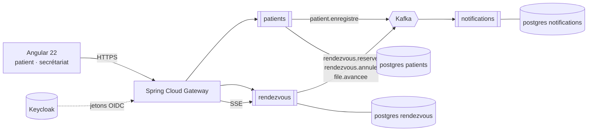

# RDV Santé

[](https://github.com/diffonathan/rdv-sante/actions/workflows/ci.yml)
[](https://adoptium.net/)
[](https://spring.io/projects/spring-boot)
[](https://angular.dev/)
[](LICENSE)

**Prise de rendez-vous et file d'attente en temps réel pour cliniques et cabinets médicaux.**

Au Maroc, prendre rendez-vous chez un spécialiste passe encore par un appel au
secrétariat, un carnet papier ou un groupe WhatsApp. Le patient se déplace, puis
attend sans savoir combien de personnes le précèdent. Le secrétariat, lui, jongle
entre le téléphone qui sonne et la salle d'attente qui se remplit.

RDV Santé traite les deux bouts du problème : le patient réserve un créneau en
ligne et **voit sa position dans la file depuis son téléphone** ; le secrétariat
pilote la journée depuis un seul écran.

> **Projet de démonstration.** Les données sont fictives, les cliniques
> inventées. Aucune donnée de santé réelle n'est traitée.

## Essayer

**→ [rdv-sante.onrender.com](https://rdv-sante.onrender.com)**

Réservez un créneau, puis ouvrez le *Secrétariat* et la *Salle d'attente* dans
deux onglets : pointer une arrivée met la file à jour sans recharger.

> L'hébergement est gratuit, donc l'application s'endort après quinze minutes
> sans visite. Le premier appel la réveille et peut demander une minute — une
> machine virtuelle Java démarre moins vite qu'un script. Les suivants sont
> immédiats.
>
> Ce qui est déployé est un **repli** : les trois services métier réunis dans un
> seul processus, les événements passant en mémoire au lieu de traverser Kafka.
> Aucune offre gratuite ne fait tourner quatre JVM et un courtier. Le code des
> services est inchangé — voir [`deploy/DEMONSTRATION.md`](deploy/DEMONSTRATION.md)
> pour ce qui est préservé et ce qui est perdu.

---

## Ce que ce dépôt démontre

| Domaine | Mise en œuvre |
|---|---|
| **Java / Spring Boot** | Java 21, Spring Boot 4.1, Spring Data JPA, Bean Validation |
| **Microservices** | 3 services métier autonomes + une passerelle Spring Cloud Gateway |
| **Messagerie** | Apache Kafka, *outbox* transactionnel, consommation idempotente |
| **Persistance** | PostgreSQL, une base par service, migrations Flyway versionnées |
| **Sécurité** | Keycloak (OAuth2 / OIDC), services en *resource servers*, rôles patient / secrétaire / médecin |
| **Front** | Angular 22, composants standalone, signals, flux temps réel par SSE |
| **Tests** | JUnit 5, Mockito, Testcontainers (PostgreSQL et Kafka réels), objectif > 80 % de couverture |
| **Industrialisation** | Docker Compose, GitHub Actions, image de déploiement mono-processus |
| **Observabilité** | Actuator, métriques Prometheus sur la passerelle |

---

## Architecture en une image



Le détail — responsabilités, contrats d'événements, et **pourquoi** chaque choix
a été fait — est dans [docs/architecture.md](docs/architecture.md). Les neuf
décisions structurantes y sont motivées une par une, avec leurs compromis
assumés.

---

## Les trois services

| Service | Responsabilité | Ce qu'il possède |
|---|---|---|
| **patients** | Identité et coordonnées du patient, consentement, préférences de contact | `Patient` |
| **rendezvous** | Cliniques, praticiens, créneaux, réservations, file d'attente du jour | `Clinique`, `Praticien`, `Creneau`, `RendezVous`, `FileAttente` |
| **notifications** | Rappels et confirmations, historique des envois, anti-doublon | `Notification`, `Preference` |

Aucun service n'appelle un autre en HTTP. Ils communiquent **uniquement par
événements Kafka** : une clinique dont le service de notification tombe continue
de prendre des rendez-vous.

---

## Démarrage

### Prérequis

- **JDK 21** — `java -version` doit afficher 21
- **Docker Desktop** démarré — PostgreSQL et Kafka tournent en conteneurs

### Lancer

```bash
# 1. l'infrastructure : PostgreSQL (3 bases) + Kafka en mode KRaft
docker compose -f deploy/compose/infra.yml up -d

# 2. le service rendezvous (jeu de démonstration chargé par le profil dev)
cd services/rendezvous && ./mvnw spring-boot:run -Dspring-boot.run.profiles=dev

# 3. les autres services, chacun dans son terminal
cd services/patients      && ./mvnw spring-boot:run -Dspring-boot.run.profiles=dev
cd services/notifications && ./mvnw spring-boot:run
cd services/gateway       && ./mvnw spring-boot:run -Dspring-boot.run.profiles=dev

# 4. le front (il appelle la passerelle, pas les services)
cd web && npm install && npm start
```

Puis ouvrir **http://localhost:4200**. Pour vérifier la plomberie sans
l'interface, **http://localhost:8081/actuator/health** doit répondre `UP` avec
`db` et `kafka` détaillés.

| Service | Port | État |
|---|---|---|
| **web** (Angular 22) | 4200 | **les trois écrans** — réservation, secrétariat, salle d'attente |
| **rendezvous** | 8081 | **fonctionnel** — réservation, file d'attente, outbox, SSE |
| **notifications** | 8083 | **fonctionnel** — consommateurs Kafka idempotents, boîte d'envoi |
| **gateway** | 8080 | **fonctionnel** — porte d'entrée unique, routage, CORS |
| **patients** | 8082 | **fonctionnel** — inscription idempotente, outbox |

La passerelle expose tout sous un seul port :
`http://localhost:8080/api/cliniques` atteint `rendezvous`,
`http://localhost:8080/api/notifications` atteint `notifications`.

### Les trois écrans

| Adresse | Pour qui | Ce qu'on y fait |
|---|---|---|
| `/` | le patient | choisit une clinique, un praticien, un horaire, et réserve |
| `/secretariat` | l'accueil | pointe les arrivées, appelle le patient suivant |
| `/salle-attente` | l'écran de la salle | affiche qui est appelé et les trois suivants |

Ouvrez `/secretariat` et `/salle-attente` dans deux fenêtres côte à côte :
cliquer sur « Appeler le suivant » d'un côté change l'écran de l'autre
**immédiatement, sans rechargement** — c'est le flux SSE (décision D7).

La boîte d'envoi des notifications se consulte sur
`http://localhost:8080/api/notifications`. Réserver depuis l'écran y fait
apparaître **deux** messages une seconde plus tard — une bienvenue et une
confirmation — produits par deux services différents qui **ne se sont jamais
parlé directement** : le front a écrit dans `patients` et dans `rendezvous`,
chacun a déposé un événement dans son outbox, et `notifications` les a
consommés depuis Kafka.

### L'API du service rendezvous

| Verbe | Chemin | Rôle |
|---|---|---|
| `GET` | `/api/cliniques` | les trois cliniques de démonstration |
| `GET` | `/api/cliniques/{id}/praticiens` | les praticiens d'une clinique |
| `GET` | `/api/praticiens/{id}/creneaux?jour=2026-10-03` | les créneaux **encore libres** |
| `POST` | `/api/rendez-vous` | réserver — `201`, ou `409` si le créneau vient d'être pris |
| `POST` | `/api/rendez-vous/{id}/annulation` | annuler ; le créneau redevient réservable |
| `GET` | `/api/cliniques/{id}/file` | l'état de la file d'attente |
| `GET` | `/api/cliniques/{id}/file/flux` | le même état, poussé en **SSE** à chaque mouvement |
| `POST` | `/api/cliniques/{id}/file/arrivees` | le secrétariat enregistre une arrivée |
| `POST` | `/api/cliniques/{id}/file/suivant` | appeler le patient suivant |

Exemple, une fois le service lancé :

```bash
curl -s http://localhost:8081/api/cliniques | head -c 300
```

### Arrêter

```bash
docker compose -f deploy/compose/infra.yml down      # garde les données
docker compose -f deploy/compose/infra.yml down -v   # efface tout
```

> **Piège connu.** `mvnw spring-boot:run` lance une JVM *séparée* du processus
> Maven. Fermer le terminal ne la tue pas toujours, et le prochain lancement
> échoue sur « Port 8081 was already in use ». Pour la trouver :
> `netstat -ano | findstr :8081`, puis `taskkill /PID <pid> /F`.

### Mémoire

L'infrastructure est plafonnée : 320 Mo pour PostgreSQL, 640 Mo pour Kafka, et
WSL2 est limité à 5 Go par `~/.wslconfig`. Sur une machine de 16 Go où le
navigateur en prend 3, ces plafonds ne sont pas un luxe.

## La documentation technique

L'application embarque deux niveaux d'explication, pour deux lecteurs :

- **« Sous le capot »** (`/technique`), ouvert à tous, sans un seul terme
  technique — il s'adresse à quelqu'un qui trie des candidatures ;
- **la documentation** (`/documentation`), derrière un mot de passe, où les
  choses sont nommées : la course sur un créneau, l'outbox, l'erreur
  d'idempotence que j'ai commise et la façon dont je l'ai trouvée.

Le mot de passe vient de l'environnement, jamais du dépôt — celui-ci est
public :

```bash
export RDV_DOCUMENTATION_MOT_DE_PASSE='…'
cd services/gateway && ./mvnw spring-boot:run
```

Non définie, la variable **ferme** l'accès au lieu de l'ouvrir avec une chaîne
vide : une variable oubliée au déploiement serait sinon une porte grande
ouverte, sans le moindre signe visible.

Le contenu est rendu **par le serveur**, et seulement après vérification. Une
documentation écrite dans le front et simplement masquée partirait dans le
paquet JavaScript : il suffirait de l'ouvrir pour tout lire sans jamais taper
le mot de passe. C'est la différence entre une porte fermée et une porte peinte
sur un mur.

## Tests

```bash
./mvnw verify          # tests unitaires + intégration (Testcontainers)
```

Les tests d'intégration démarrent un vrai PostgreSQL et un vrai Kafka via
Testcontainers : **aucune base en mémoire**, aucun *mock* de *broker*. Ce qui
passe en test passe en production. Docker doit donc tourner.

Le test qui compte : `unSeulGagneLaCourse` lance **huit fils qui réservent le
même créneau à la même milliseconde** et vérifie qu'exactement un aboutit, que
les sept autres reçoivent un conflit — pas une erreur serveur — et que la base
ne contient qu'un rendez-vous actif. C'est la démonstration que la décision D4
tient : une vérification applicative aurait laissé passer plusieurs
réservations.

---

## Licence

MIT — voir [LICENSE](LICENSE).
