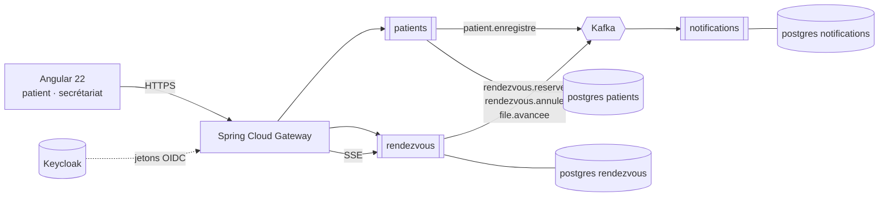

# RDV Santé

**Prise de rendez-vous et file d'attente en temps réel pour cliniques et cabinets médicaux.**

Au Maroc, prendre rendez-vous chez un spécialiste passe encore par un appel au
secrétariat, un carnet papier ou un groupe WhatsApp. Le patient se déplace, puis
attend sans savoir combien de personnes le précèdent. Le secrétariat, lui, jongle
entre le téléphone qui sonne et la salle d'attente qui se remplit.

RDV Santé traite les deux bouts du problème : le patient réserve un créneau en
ligne et **voit sa position dans la file depuis son téléphone** ; le secrétariat
pilote la journée depuis un seul écran.

> **Projet de démonstration.** Les données sont fictives, les cliniques
> inventées. Aucune donnée de santé réelle n'est traitée.

---

## Ce que ce dépôt démontre

| Domaine | Mise en œuvre |
|---|---|
| **Java / Spring Boot** | Java 21, Spring Boot 4.1, Spring Data JPA, Bean Validation |
| **Microservices** | 3 services métier autonomes + une passerelle Spring Cloud Gateway |
| **Messagerie** | Apache Kafka, *outbox* transactionnel, consommation idempotente |
| **Persistance** | PostgreSQL, une base par service, migrations Flyway versionnées |
| **Sécurité** | Keycloak (OAuth2 / OIDC), services en *resource servers*, rôles patient / secrétaire / médecin |
| **Front** | Angular 22, composants standalone, signals, flux temps réel par SSE |
| **Tests** | JUnit 5, Mockito, Testcontainers (PostgreSQL et Kafka réels), objectif > 80 % de couverture |
| **Industrialisation** | Docker Compose, Helm et Kubernetes, GitHub Actions, analyse SonarQube |
| **Observabilité** | Actuator, métriques Prometheus, traçage distribué |

---

## Architecture en une image



Le détail — responsabilités, contrats d'événements, et **pourquoi** chaque choix
a été fait — est dans [docs/architecture.md](docs/architecture.md). Les neuf
décisions structurantes y sont motivées une par une, avec leurs compromis
assumés.

---

## Les trois services

| Service | Responsabilité | Ce qu'il possède |
|---|---|---|
| **patients** | Identité et coordonnées du patient, consentement, préférences de contact | `Patient` |
| **rendezvous** | Cliniques, praticiens, créneaux, réservations, file d'attente du jour | `Clinique`, `Praticien`, `Creneau`, `RendezVous`, `FileAttente` |
| **notifications** | Rappels et confirmations, historique des envois, anti-doublon | `Notification`, `Preference` |

Aucun service n'appelle un autre en HTTP. Ils communiquent **uniquement par
événements Kafka** : une clinique dont le service de notification tombe continue
de prendre des rendez-vous.

---

## Démarrage

### Prérequis

- **JDK 21** — `java -version` doit afficher 21
- **Docker Desktop** démarré — PostgreSQL et Kafka tournent en conteneurs

### Lancer

```bash
# 1. l'infrastructure : PostgreSQL (3 bases) + Kafka en mode KRaft
docker compose -f deploy/compose/infra.yml up -d

# 2. le service rendezvous (jeu de démonstration chargé par le profil dev)
cd services/rendezvous && ./mvnw spring-boot:run -Dspring-boot.run.profiles=dev

# 3. le service notifications, dans un autre terminal
cd services/notifications && ./mvnw spring-boot:run

# 4. le front
cd web && npm install && npm start
```

Puis ouvrir **http://localhost:4200**. Pour vérifier la plomberie sans
l'interface, **http://localhost:8081/actuator/health** doit répondre `UP` avec
`db` et `kafka` détaillés.

| Service | Port | État |
|---|---|---|
| **web** (Angular 22) | 4200 | **les trois écrans** — réservation, secrétariat, salle d'attente |
| **rendezvous** | 8081 | **fonctionnel** — réservation, file d'attente, outbox, SSE |
| **notifications** | 8083 | **fonctionnel** — consommateurs Kafka idempotents, boîte d'envoi |
| patients | 8082 | squelette, pas encore configuré |
| gateway | 8080 | squelette, pas encore configuré |

### Les trois écrans

| Adresse | Pour qui | Ce qu'on y fait |
|---|---|---|
| `/` | le patient | choisit une clinique, un praticien, un horaire, et réserve |
| `/secretariat` | l'accueil | pointe les arrivées, appelle le patient suivant |
| `/salle-attente` | l'écran de la salle | affiche qui est appelé et les trois suivants |

Ouvrez `/secretariat` et `/salle-attente` dans deux fenêtres côte à côte :
cliquer sur « Appeler le suivant » d'un côté change l'écran de l'autre
**immédiatement, sans rechargement** — c'est le flux SSE (décision D7).

La boîte d'envoi des notifications se consulte sur
`http://localhost:8083/api/notifications` : une réservation faite à l'écran y
apparaît une seconde plus tard, **sans que les deux services se soient parlé
directement**.

### L'API du service rendezvous

| Verbe | Chemin | Rôle |
|---|---|---|
| `GET` | `/api/cliniques` | les trois cliniques de démonstration |
| `GET` | `/api/cliniques/{id}/praticiens` | les praticiens d'une clinique |
| `GET` | `/api/praticiens/{id}/creneaux?jour=2026-10-03` | les créneaux **encore libres** |
| `POST` | `/api/rendez-vous` | réserver — `201`, ou `409` si le créneau vient d'être pris |
| `POST` | `/api/rendez-vous/{id}/annulation` | annuler ; le créneau redevient réservable |
| `GET` | `/api/cliniques/{id}/file` | l'état de la file d'attente |
| `GET` | `/api/cliniques/{id}/file/flux` | le même état, poussé en **SSE** à chaque mouvement |
| `POST` | `/api/cliniques/{id}/file/arrivees` | le secrétariat enregistre une arrivée |
| `POST` | `/api/cliniques/{id}/file/suivant` | appeler le patient suivant |

Exemple, une fois le service lancé :

```bash
curl -s http://localhost:8081/api/cliniques | head -c 300
```

### Arrêter

```bash
docker compose -f deploy/compose/infra.yml down      # garde les données
docker compose -f deploy/compose/infra.yml down -v   # efface tout
```

> **Piège connu.** `mvnw spring-boot:run` lance une JVM *séparée* du processus
> Maven. Fermer le terminal ne la tue pas toujours, et le prochain lancement
> échoue sur « Port 8081 was already in use ». Pour la trouver :
> `netstat -ano | findstr :8081`, puis `taskkill /PID <pid> /F`.

### Mémoire

L'infrastructure est plafonnée : 320 Mo pour PostgreSQL, 640 Mo pour Kafka, et
WSL2 est limité à 5 Go par `~/.wslconfig`. Sur une machine de 16 Go où le
navigateur en prend 3, ces plafonds ne sont pas un luxe.

## Tests

```bash
./mvnw verify          # tests unitaires + intégration (Testcontainers)
```

Les tests d'intégration démarrent un vrai PostgreSQL et un vrai Kafka via
Testcontainers : **aucune base en mémoire**, aucun *mock* de *broker*. Ce qui
passe en test passe en production. Docker doit donc tourner.

Le test qui compte : `unSeulGagneLaCourse` lance **huit fils qui réservent le
même créneau à la même milliseconde** et vérifie qu'exactement un aboutit, que
les sept autres reçoivent un conflit — pas une erreur serveur — et que la base
ne contient qu'un rendez-vous actif. C'est la démonstration que la décision D4
tient : une vérification applicative aurait laissé passer plusieurs
réservations.

---

## Licence

MIT — voir [LICENSE](LICENSE).
