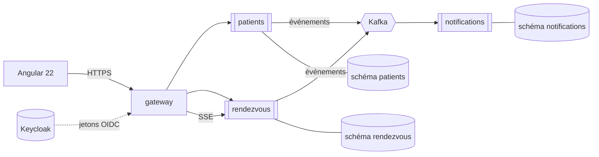

# Architecture — RDV Santé

Ce document explique **ce qui est construit et pourquoi**. Chaque décision porte
son motif et, quand il y en a un, son compromis assumé. C'est la partie du dépôt
à lire avant le code.

---

## 1. Le problème

Trois acteurs, trois frustrations :

| Acteur | Ce qu'il vit aujourd'hui | Ce que l'outil lui apporte |
|---|---|---|
| **Patient** | Appelle, n'obtient pas la ligne, se déplace, attend sans savoir combien de temps | Réserve en ligne, voit sa position dans la file depuis son téléphone |
| **Secrétaire** | Carnet papier ou WhatsApp, téléphone qui sonne pendant qu'elle enregistre une arrivée | Un seul écran : agenda du jour, arrivées, file d'attente |
| **Médecin** | Découvre son planning en arrivant | Son agenda, à jour, consultable |

Le cœur du produit n'est pas la réservation — c'est **la file d'attente en temps
réel**. C'est elle qui supprime l'attente debout dans un couloir.

---

## 2. Découpage en services



| Service | Responsabilité | Agrégats qu'il possède |
|---|---|---|
| **patients** | Identité, coordonnées, consentement, préférence de contact | `Patient` |
| **rendezvous** | Cliniques, praticiens, créneaux, réservations, file du jour | `Clinique`, `Praticien`, `Creneau`, `RendezVous`, `EntreeFile` |
| **notifications** | Confirmations et rappels, boîte d'envoi, anti-doublon | `Notification`, `MessageTraite` |
| **gateway** | Porte d'entrée unique, validation des jetons, routage | — |

Le service `notifications` ne connaît **aucune** adresse de `rendezvous` : il ne
lit que des topics Kafka. Il recopie les contrats d'événements dont il a besoin
plutôt que de partager une bibliothèque commune — un module partagé recréerait
le couplage que les événements servent à défaire, en obligeant tous les
consommateurs à recompiler avant que l'émetteur ne puisse évoluer. La
contrepartie obligatoire est `@JsonIgnoreProperties(ignoreUnknown = true)` :
un champ ajouté par l'émetteur est ignoré au lieu de bloquer la consommation.

**Pourquoi ces trois-là.** Le découpage suit les rythmes de changement, pas les
couches techniques. L'identité d'un patient change rarement ; les créneaux
changent toutes les minutes ; les canaux de notification changent quand on
ajoute WhatsApp. Trois rythmes, trois services. Un découpage en
« contrôleurs / services / dépôts » aurait donné trois déploiements couplés,
c'est-à-dire un monolithe distribué — le pire des deux mondes.

---

## 3. Communication : événements uniquement

**Aucun service n'appelle un autre en HTTP.** Ils publient et consomment des
événements Kafka.

Conséquence concrète : si `notifications` tombe, les rendez-vous continuent
d'être pris. Les messages l'attendent dans le *topic*, il rattrape à son retour.
Avec un appel HTTP synchrone, la panne du service de notification aurait fait
échouer la réservation — un patient perdu pour un SMS non parti.

### Contrats d'événements

| Topic | Émis par | Consommé par | Contenu |
|---|---|---|---|
| `patient.enregistre` | patients | notifications | id, préférence de contact |
| `rendezvous.reserve` | rendezvous | notifications | id RDV, id patient, praticien, horaire |
| `rendezvous.annule` | rendezvous | notifications | id RDV, motif |
| `file.avancee` | rendezvous | notifications | id clinique, patient appelé, position des suivants |

Chaque message porte une **clé d'idempotence** (`evenementId`, un UUID) et la
clé de partition est l'identifiant de l'agrégat — tous les événements d'un même
rendez-vous atterrissent donc dans la même partition, et **leur ordre est
garanti**. Sans cela, une annulation pourrait être traitée avant la réservation
qu'elle annule.

---

## 4. Les décisions

### D1 — Spring Boot 4.1.1, pas 3.x

`start.spring.io` ne propose plus Spring Boot 3 : la branche courante est la 4.1.
Le projet est donc sur 4.1.1 avec Java 21 (LTS). Les concepts que cherchent les
recruteurs — auto-configuration, *starters*, Actuator, Data JPA — sont
identiques ; la 4 resserre surtout la configuration native et le module HTTP.

### D2 — Outbox transactionnel

Le problème classique : enregistrer le rendez-vous **et** publier l'événement.
Deux systèmes, pas de transaction commune. Si la base réussit et Kafka échoue,
le patient a un rendez-vous dont personne n'est prévenu ; dans l'autre sens, on
notifie un rendez-vous qui n'existe pas.

La solution retenue écrit l'événement **dans la même transaction que la donnée**,
dans une table `evenement_sortant`. Un publieur périodique lit les lignes non
publiées et les envoie à Kafka. Rien ne se perd, rien ne s'invente.

```
┌── transaction SQL ────────────────┐
│  INSERT rendez_vous               │
│  INSERT evenement_sortant         │   puis, hors transaction :
└───────────────────────────────────┘   publieur → Kafka → marque publie_le
```

Le prix à payer : la publication est *asynchrone* (quelques centaines de
millisecondes de retard) et le consommateur peut recevoir deux fois le même
message — d'où D3.

### D3 — Consommateurs idempotents

Kafka garantit *au moins une fois*, pas *exactement une fois*. Chaque
consommateur tient une table `message_traite` dont la clé primaire est
l'`evenementId`. Un doublon viole la contrainte d'unicité, il est ignoré. C'est
ce qui empêche un patient de recevoir deux fois le même SMS de confirmation.

### D4 — La double réservation se règle en base

Deux patients cliquent sur le même créneau à la même seconde. Une vérification
applicative (« ce créneau est-il libre ? » puis « je le prends ») laisse une
fenêtre entre les deux requêtes.

La garantie est posée là où elle tient vraiment : un **index unique** sur
`(creneau_id)` pour les rendez-vous non annulés. Le second `INSERT` échoue, la
violation est traduite en `409 Conflict`, et l'interface propose le créneau
suivant. La base est la seule à pouvoir arbitrer sans condition de course.

### D5 — Une base par service, logiquement

« Database per service » veut dire : **aucun service ne lit les tables d'un
autre**, pas de jointure entre contextes, des migrations Flyway indépendantes.

En développement, les trois schémas vivent dans **une seule instance
PostgreSQL** : trois conteneurs coûteraient 400 Mo de plus sur une machine qui
en manque (§6). La séparation logique est stricte — un utilisateur SQL par
service, des droits limités à son schéma — donc le passage à trois instances
séparées ne demande que de changer trois URL. Le compromis est assumé et
réversible ; l'inverse (des jointures entre services) ne l'aurait pas été.

### D6 — Kafka en mode KRaft

Pas de Zookeeper : un conteneur de moins et environ 300 Mo économisés. C'est
aussi le mode par défaut de Kafka depuis la version 4.

### D7 — SSE plutôt que WebSocket pour la file d'attente

Le flux est à sens unique : le serveur pousse les mouvements de la file, le
navigateur n'envoie rien (les actions de la secrétaire passent par des appels
REST ordinaires). Pour ce besoin, **Server-Sent Events** suffit et coûte moins
cher : pas de négociation de protocole, reconnexion automatique intégrée à
`EventSource`, et ça traverse les proxies d'entreprise sans configuration. Un
WebSocket n'aurait servi que si le client émettait aussi.

### D8 — Keycloak, services en *resource servers*

Keycloak délivre les jetons ; la passerelle et les services les **valident** sans
jamais détenir de mot de passe. Trois rôles : `patient`, `secretaire`, `medecin`.
Chaque service vérifie le jeton lui-même : une passerelle percée ne doit pas
ouvrir l'accès aux services derrière elle.

### D9 — Angular 22

La version courante, et la seule compatible avec le Node 24 de la machine de
développement (Angular 18 et 19 s'arrêtent à Node 22). Composants *standalone* et
*signals* y sont le mode par défaut. Le flux SSE alimente directement un signal,
que les écrans lisent par `computed()` : aucune recopie, aucune scrutation.

### D10 — L'idempotence passe par `ON CONFLICT DO NOTHING`, pas par `save()`

La première version de la garde anti-doublon (décision D3) **ne gardait rien**,
et rien ne le montrait.

Elle appelait `save()` sur une entité `MessageTraite` dont l'identifiant est
*assigné* — l'identifiant de l'événement. Spring Data considère alors l'objet
comme existant et appelle `merge()` : Hibernate fait un SELECT puis un UPDATE.
La clé primaire n'est jamais violée, aucune exception n'est levée, la méthode
conclut « nouveau message » et écrit une seconde notification.

Le défaut est invisible à la lecture : le code *ressemble* à une garde. Il n'est
apparu qu'en rembobinant les topics Kafka et en constatant que 11 messages
rejoués produisaient 11 notifications de plus.

La garde est désormais une insertion explicite :

```sql
INSERT INTO message_traite (evenement_id, topic, traite_le)
VALUES (:evenementId, :topic, now())
ON CONFLICT (evenement_id) DO NOTHING
```

Elle renvoie 1 (nouveau) ou 0 (doublon). Deux avantages sur l'exception : le
contrôle de flux ne passe plus par un `catch`, et l'opération reste atomique
face à plusieurs consommateurs concurrents — ce que vérifie `IdempotenceIT`.

---

## 5. Tests

| Niveau | Outils | Ce qu'on y vérifie |
|---|---|---|
| Unitaire | JUnit 5, Mockito | Règles métier : chevauchement de créneaux, ordre de la file, calcul du rappel |
| Intégration | Testcontainers (PostgreSQL, Kafka **réels**) | Migrations Flyway, requêtes JPA, publication et consommation d'événements |
| Bout en bout | Playwright | Réservation, arrivée du patient, avancée de la file |

**Aucune base en mémoire, aucun *broker* simulé.** Une base H2 accepte du SQL que
PostgreSQL refuse ; un `MockProducer` ne rejoue pas un rééquilibrage de
partitions. Ce qui passe ici passe en production.

---

## 6. Contrainte matérielle assumée

La machine de développement a 16 Go, dont **environ 3 Go réellement
disponibles** une fois le navigateur et les outils ouverts. La pile complète
demande 6 à 8 Go. D'où deux profils :

| Profil | Ce qui tourne | Mémoire |
|---|---|---|
| **léger** (quotidien) | PostgreSQL + Kafka (KRaft) + le service en cours, sécurité désactivée | ≈ 1,5 Go |
| **complet** (démonstration, vidéo) | Les 4 services + Keycloak + Angular + l'infrastructure | ≈ 6 Go |

WSL2 est plafonné à 5 Go par `~/.wslconfig`, avec restitution progressive de la
mémoire. Sans ce plafond, WSL s'autorise la moitié de la RAM et ne la rend
jamais.

---

## 7. Limites, dites franchement

- **Les notifications ne partent pas vraiment.** Aucun contrat SMS n'est souscrit
  pour un projet de démonstration : les envois sont écrits en base et affichés
  dans un écran « boîte d'envoi ». Le point d'extension vers un vrai fournisseur
  est isolé derrière une interface.
- **Pas de paiement.** Hors sujet pour une prise de rendez-vous médicale au Maroc,
  où le règlement se fait au cabinet.
- **Pas de données de santé.** L'outil manipule des rendez-vous, jamais un
  diagnostic ni un dossier médical — ce qui le tient hors du périmètre
  réglementaire le plus lourd.
- **Jeu de données fictif.** Trois cliniques, une dizaine de praticiens, des
  patients inventés.
